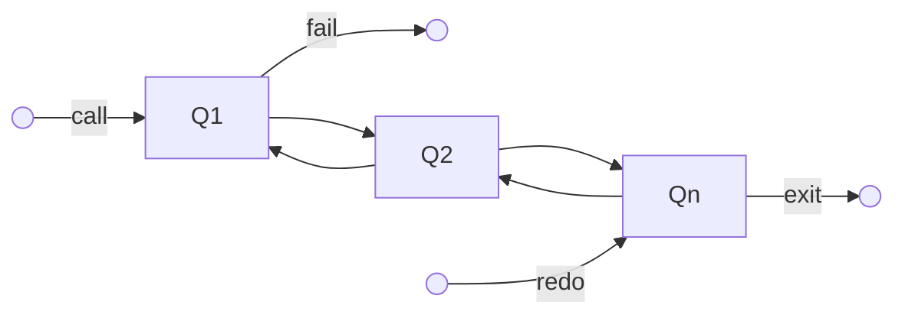

# Paradigma Lógico 

## Prolog

O Prolog é uma linguagem de programação do paradigma lógico, que se baseia em **predicados**. A programação, sobre o viés lógico, é declarativa, isso quer dizer que o programador descreve o que quer fazer, e não como fazer exatamente. 

## Predicados

Como dito anteriormente, o Prolog é baseado em predicados. Um predicado é uma declaração lógica que expressa relações entre objetos ou representam regras de inferência. 

1. Fatos -> Declara algo que é verdadeiro.
2. Regras -> Define relações lógicas entre fatos e outros predicados.
3. Consultas -> Perguntas feitas ao Prolog para obter informações com base nos fatos e regras definidas.

```tabs

tab: Fato 
> Sintaxe básica para um fato

```prolog
fato(argumento1, argumento2, ..., argumentoN).

tab: Regra
> Sintaxe básica para uma regra

```prolog
regra(Argumento1, Argumento2) :- condicao1, condicao2.

tab: Consulta
> Sintaxe básica para uma consulta

```prolog
?- consulta(argumento1, argumento2).

```

Argumentos podem ser quaisquer termos válidos em prolog. 
## Termos 

1. Átomos: são constantes iniciados por letra minúscula ou qualquer sequência alfanumérica entre aspas simples `''`. (E.g., joao, 'joao', '7').
2. Variáveis: iniciadas por letra maiúscula ou underscore. (E.g., X, \_).
3. Inteiros: números inteiros. (E.g., 1, 2, 3).
4. Floats: números decimais. (E.g., 1.0, 2.0, 3.0).
5. Listas: sequência de termos separados por vírgula e delimitados por colchetes. (E.g., [1, 2, 3], [joao, maria, pedro]). Caracteres entre aspas duplas `""` são tratados como listas de inteiros. 

## Consultas simples

As consultas em Prolog são feitas através de **pattern matching**. O Prolog tenta casar a consulta com os fatos e regras definidos. O "padrão" de uma consulta é denominado **goal**. Se algum fato presente na knowledge base satisfaz o goal, a consulta é bem sucedida e o interpretador retorna `true`, caso contrário retorna `false`.  

O pattern matching é feito através de unificação. A unificação é o processo de encontrar uma substituição que torne dois termos idênticos. 

```prolog
% Fatos
animal(leao).
animal(girafa).
animal(tubarao).

% Consultas
% -? animal(X).
%	X = leao ;
%	X = girafa ;
%	X = tubarao.
```

No exemplo acima, ocorre a unificação da variável `X` com os fatos presentes na knowledge base.

## Backtracking

O Prolog utiliza um mecanismo de busca chamado **backtracking** para explorar todas as possibilidades de unificação. Quando ele tenta satisfazer um objetivo acerca de um predicado, ele percorre todas as cláusulas que definem o predicado. Assim que há um match, a cláusula em questão é marcada indicando que ela satisfez o objetivo. Se o usuário solicitar mais respostas `;` ele retoma a busca a partir do ponto que parou.


## Consultas compostas

As consultas simples podem ser combinadas por meio do operador `,` (e). A sintaxe para consultas compostas é a seguinte:

```prolog
query1(a1, ..., ak), query2(b1, ..., bm), ..., queryN(n1, ..., nk)
```

Se a mesma variável aparecer em mais de uma consulta, o Prolog irá unificá-las, ou seja, para que haja o match, os valores devem ser os mesmos em todos os predicados. 

O processo de backtracking é usado para tentar encontrar todos os objetivos possíveis da esquerda para a direita. 

### As "Quatro portas" de um objetivo

Em prolog, quando um objetivo `G` é avaliado ele pode passar por 4 estágios:

1. CALL -> Prolog tenta satisfazer o objetivo `G`.
2. EXIT -> Se `G` for satisfeito ele continua para o próximo objetivo.
3. FAIL -> Se `G` não for satisfeito, o Prolog tenta a próxima cláusula.
4. REDO -> Se `G` for satisfeito, mas o usuário solicitar mais respostas, o Prolog tenta a próxima cláusula.


~~~ tabs

tab: Fluxograma


tab: Exemplo

> O comando `trace/0` foi usado para visualizar o processo de backtracking.

```prolog
[trace]  ?- capital(X).
   Call: (12) capital(_34764) ? creep
   Exit: (12) capital('Brasília') ? creep
X = 'Brasília' ;
   Redo: (12) capital(_34764) ? creep
   Exit: (12) capital('Belo Horizonte') ? creep
X = 'Belo Horizonte' ;
   Redo: (12) capital(_34764) ? creep
   Exit: (12) capital('São Paulo') ? creep
X = 'São Paulo'.
```
~~~ 


