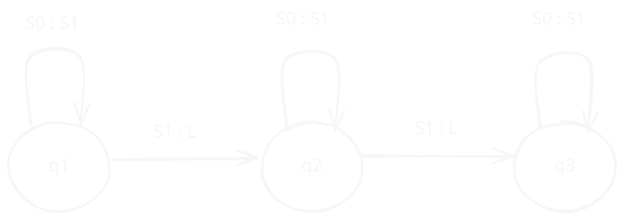

# Máquina de Turing

Uma máquina de Turing é uma máquina abstrata (idealizada) para realizar computações, de forma sistemática, sobre números ∈ ℤ+, representados em notação monádica. 

> **Notação Monádica**:
> A notação monádica é uma forma de representar números naturais usando apenas o símbolo "1" ou "|" ou "$S_n$". Por exemplo, o número 3 seria representado como "111" ou "|||" ou "$S_3$".

A computação acontece sobre uma fita (memória) linear infinita em ambas direções e dividia em quadrados. Cada quadrado ou está em branco ou tem um traço.

## Instruções

As instruções dessa máquina são de caráter condicional, ou seja, dependem do estado atual da máquina e do valor contido no quadrado atual. São definidas a seguir:

> [!list] Instruções
> 
>1. E ou S0 (erase): Escrever '0' na posição atual da fita. 
>2. W ou S1 (write): Escrever '1' na posição atual da fita.
>3. L (left): Mover a cabeça da máquina uma posição para a esquerda.
>4. R (right): Mover a cabeça da máquina uma posição para a direita.
>5. H (halt): Parar a máquina.
>
> > Obs: A instruções "W" em um quadrado com "1", ou a instrução "E" em um quadrado com "0" são equivalente a "não fazer nada". 

Um "programa" em máquina de Turing consiste na descrição de todos os estados possíveis da máquina, juntamente com as instruções a serem executadas em cada estado, a depender do valor encontrado na fita.

## Formas de representação de um programa

````tabs

tab: Tabela de máquina
Uma **Tabela de máquina** é uma tabela bidimensional que discrimina um programa de máquina de Turing. Cada linha da tabela representa um estado da máquina e cada coluna representa uma ação a ser tomada com base no valor encontrado na fita.

| Estado | 0    | 1   |
| ------ | ---- | --- |
| q1     | S1q1 | Lq2 |
| q2     | S1q2 | Lq3 |
| q3     | S1q3 |     |
tab: Fluxograma
Uma forma alternativa é a representação através de um **Fluxograma**. Nessa forma, cada estado possível é representado por um círculo, e as transições possíveis por setas que partem do estado atual para o próximo estado, com rótulo $S_i : I_k$ onde $S_i$ é o símbolo presente na posição atual da fita e $I_k$ é a instrução a ser seguida.


tab: Quádruplas
Um programa também pode ser descrito através de um conjunto de quádruplas (qa, Si, Ik, qb). Si e Ik possuem os mesmos significados que na representação em fluxograma, e qa e qb são o estado inicial e o próximo estado a ser seguido, respectivamente.

$$\space$$

```lisp
(q1, S0, S1, q1)
(q1, S1,  L, q2)
(q2, S0, S1, q2)
(q2, S1,  L, q3)
(q3, S0, S1, q3)
(q3, S1,  L, q3)
```
````

## Configurações

O funcionamento de uma máquina pode ser descrito por uma sequência de configurações. Cada configuração apresenta a fita por completo, o estado atual e a posição a ser examinada.
$$
\Huge 11010_3101
$$
O subíndice indica o que a máquina está analisando aquela posição no estado "3".


<!-- ## Exemplo 1: Paridade -->

## Especificação para uma MT

Pare definir a Tese de Turing é preciso especificar o funcionamento de uma máquina de Turing. Para uma função de *k* argumentos em máquina de Turing, temos que:

1. Os argumentos m1, m2, ..., mk, são apresentados em notação monádica em *k* blocos de 1^mi traços; os blocos são separados por um único espaço em branco e todo o restante da fita está em branco.
2. A posição inicial da cabeça da máquina é a primeira posição do primeiro bloco de traços; **1 e 2** definem a **configuração inicial** da máquina.
3. Se *f*(m1, ,m2, ..., mk) = n, então a máquina deve parar na posição do primeiro traço do primeiro bloco de traços do resultado n, e todo o restante da fita deve estar em branco; esta é a **configuração final** (padrão) da máquina.
4. Se *f* não é definida para todos os argumentos, ou a máquina não irá parar, ou irá parar em uma posição diferente da configuração final padrão, ou com a fita não completamente em branco.

## Computabilidade por MT

Uma função de *k* argumentos é computável por Máquina de Turing, ou simplesmente **Turing Computável** se existe uma máquina que atenda as especificações apresentadas e que compute f(x) | ∀x ∈ Domínio E f(x) ∈ Imagem.

>[!box] Tese de Turing
>Toda função [[Conceitos#Computabilidade|efetivamente computável]] é Turing computável.

Logo, sabendo que o conjunto de todas as funções de Z+ em Z+ não é enumerável, e que o conjunto das Máquinas de Turing é enumerável (visto que podem ser representadas por Quádruplas), concluímos que existem funções que não são efetivamente computáveis, ou seja, não são computáveis por Máquina de Turing. Isso tudo, é claro, considerando que a Tese de Turing seja verdadeira, o que, apesar de fortes indícios, ainda não foi provado devido a imprecisão no conceito de computabilidade.

## Especificações de uma Lista de Quádruplas

1. O estado de menor número (1) é o **estado inicial**
2. O estado de maior número (n + 1) é o **estado de parada**; para este estado não há instruções nem quádruplas
3. Para cada estado, exceto o de parada, existe uma quádrupla iniciando com *qiSj*, para i = 1..n e j = {0, 1}
4. Apartir de **3** se as quádruplas forem ordenadas por *i e j*, os dois primeiros símbolos de se tornam previsíveis e, portanto, podem ser omitidos
5. Os estados *qi* podem ser representados pelo inteiro *i* e as instruções *Sj* podem ser representadas por um inteiro (*j* + 1) e L e R pelos inteiros 3 e 4, respectivamente. 

>[!important] 
>Dessa forma, qualquer Máquina de Turing pode ser codificada de forma única pelo [[Conceitos#Teorema Fundamental da Aritmética|Teorema Fundamental da Aritmética]] em um número inteiro positivo.

## Enumerabilidade das MT

Pela codificação apresentada, é possível enumerar as Máquinas de Turing M1, M2,... e, portanto, o conjunto de todas as MT é enumerável.

Nem todo inteiro positivo corresponde à uma MT, isso depende da sua decomposição em fatores primos.

Para que tal sequência represente uma máquina de turing, ela deve 
seguir as seguintes regras:

i. |ak| = 4n, ou seja, o tamanho da sequência precisa ser múltiplo de 4.
ii. ai ∈ [1..4], se o índice i é ímpar
iii. aj ∈ [1..n+1], se o índice j é par

### Função Diagonal

Seja fi a função computada pela i-ésima MT. A função diagonal de d é definida por:
$$
\Huge
d(n) = \{2, \space\text{se}\space f_n(n) \space\text{é definida e} \space f_n(n) = 1; \space1, caso \space contrário\}
$$

### Problema da parada

A Tese de Turing afirma que a função diagonal não é computável. Porém, a priori, parece ser possível computar d(n). A situação difícil de computar acontece quando fn(m) roda indefinidamente. Não há, ainda, uma forma de prever ou decidir se, para uma MT qualquer, fi para ou não para para o argumento m.

